>Project report on Github (readme file) Or Unity Teams:
Create a 3- to 5-minute video (mandatory) showing the use of your application with your voice over. That video should appear on the top of your github readme file. The video can be used as a backup during your presentation just in case of something go wrong.
Clearly explain the duties of each student in your group (if you work as a group).
Describe your application by screenshots (with meaningful captions) and text. Make sure you have the list and screenshots of models.
Links to all the source code and any assets (models, textures, sounds). Make sure you source code is well-commented.

# Demo
**(Video link)**

# Introduction

Virtual Reality (VR) is a simulated experience that allows people to immerse themselves in any new world. It has become a new era of visualization technology recently with many applications in various fields such as gaming and education.
In this project, we develop **Skeletons** , a puzzle game aiming to educate players about the skeletal system using [Oculus Rift](https://www.oculus.com/rift/).
Our aim is to provide an interactive and appealing educational application to facilitate learning about bones and the skeletal system.

# Design Solution

First, we use [Blender](https://www.blender.org/) to create the bone models from a full skeleton model [1]. These individual bones are then used to design the game and scaled so that the final assembled full skeleton was 6 feet tall. The game is implemented using [Unity](https://unity.com/) for gameplay on [Oculus Rift](https://www.oculus.com/rift/). 

For this game, the player has the choice between three game difficulties, *Easy Mode*, *Medium Mode*, and *Hard Mode*. In *Easy Mode*, the player assembles a detailed ribcage. For *Medium Mode*, the player assembles all of the bones of the human skeleton. For *Hard Mode*, the player assembles a detailed model of the human skull. When assembling the bones, an audible snap is presented to the player when the player positions the bone in the correct location. When the bone is released after the snap sound is heard, the bone anchor relocates to the position of the predetermined snap location.
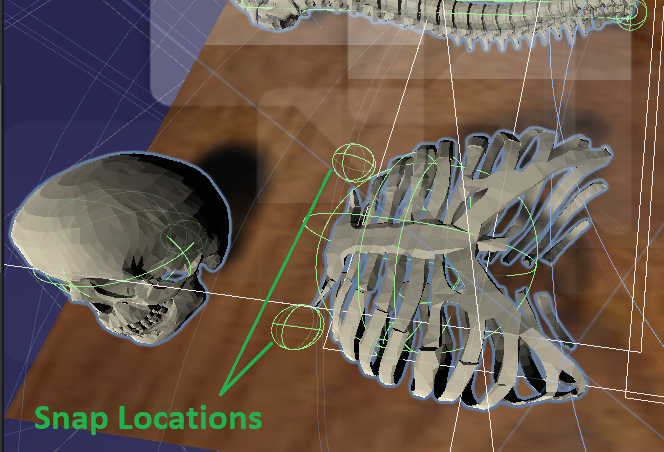

When a bone is grabbed by the user, the name of the bone appears next to the bone with the purpose to aid in the education of the player.

To track the performance of the player, a timer is implemented to start when the player selects a game mode. After the player assembles the model of the selected game mode, the timer is automatically stopped to track how long it took to assemble the model. 

If a case arises when the player does not know the correct connection of a particular bone, the player can reference the skeleton located by the welcome menu for a hint. 

# Game Descriptions
There are three difficulty levels in the game, namely *Easy Mode*, *Medium Mode*, and *Hard Mode*. At the welcome screen, the user can choose the mode from the Menu. The timer will start to count and be shown in the top right corner of the headset after the mode is chosen.
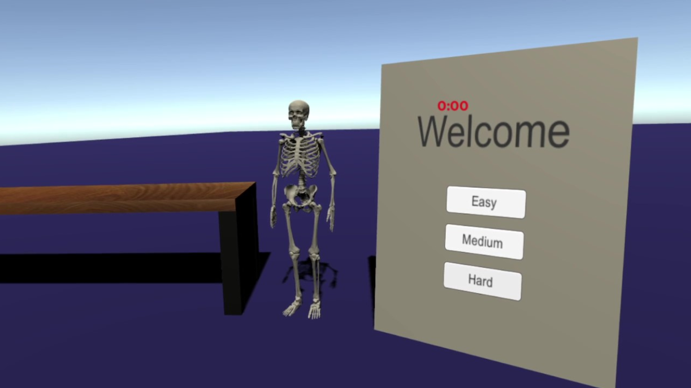

**Easy Mode**
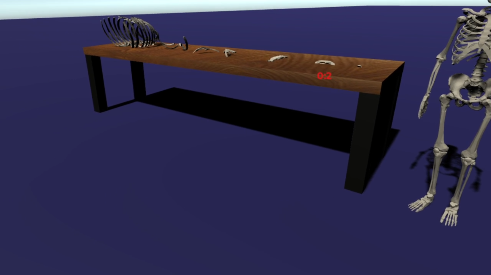

| Models | Description |
| --- | --- |
| 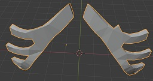 | CastalCartilage |
| 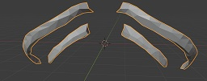 | FloatingRibs|
| 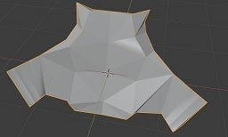 | Manubrium |
| 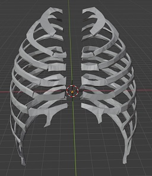 | Ribs |
| 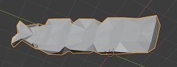 | Sternum|
| 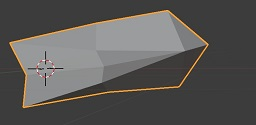 |XyphiodProcess |

**Medium Mode**
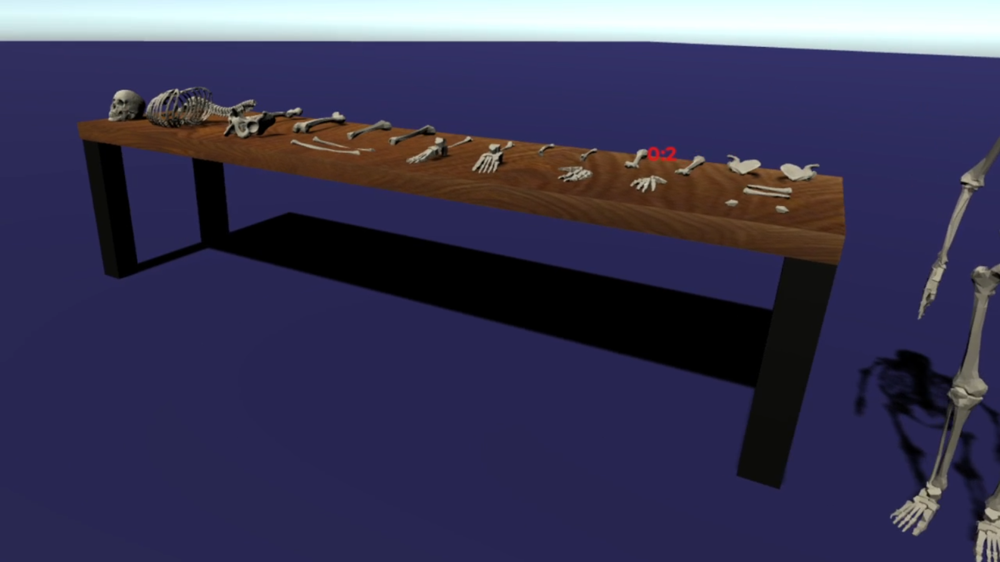

| Models | Description |
| --- | --- |
| 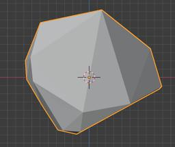 | Patella |
| 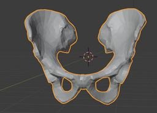 | Pelvis|
|  | Radius |
| 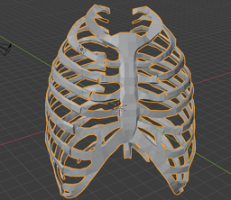 | RibCages |
| 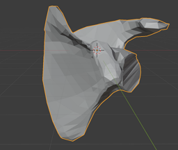 | Scapula|
| 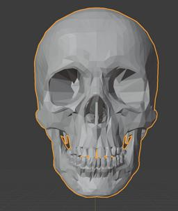 |Skull |
| 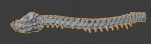 | Spine |
| 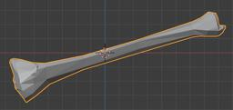 | Tibia |
| 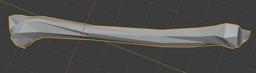 | Ulna |
| 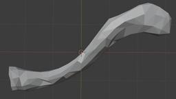 | Clavicle |
| 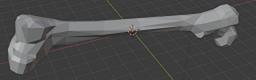 | Femur|
| 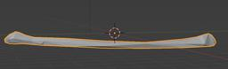 | Fibula |
| 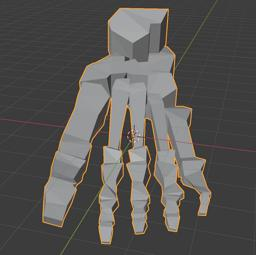 | Foot |
| 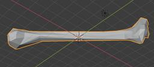 | Humerus |
| 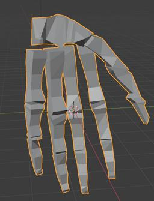 | Hand |

**Hard Mode**
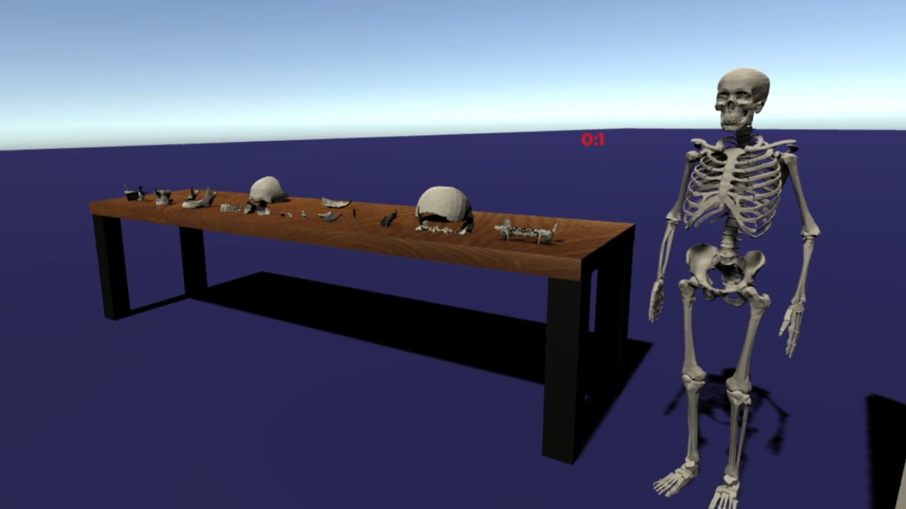

| Models | Description |
| --- | --- |
| 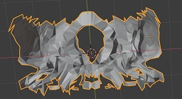 | TemporalBone |
| 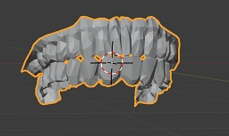 | Teeth|
| 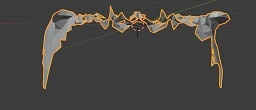 | ZygomaticArch|
| 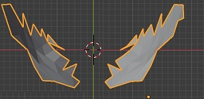 | SphenoidBone |
|  | Scapula|
| 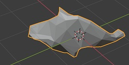 |RightZygomaticBone |
| 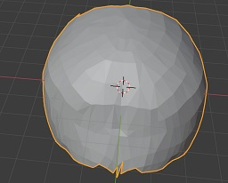 | ParietalBone |
| 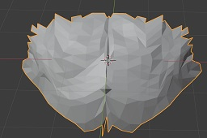 | OccipitalBone |
| 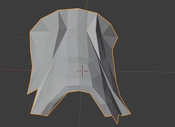 | NasalBone|
| 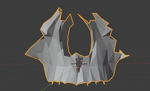 | Maxilla|
| 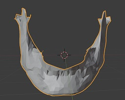 | Mandible|
| 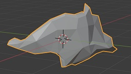 | ZygomaticBone |
| 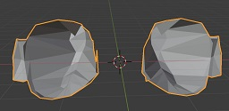 | EyesSocket|
| 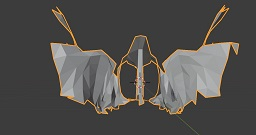 | EthmoidBone|

# Team Contribution
- Make the bones - Afam, Jake
- Set up Oculus Rift - Chau
- Set up Unity project - Chau
- Import the bones to Unity project - Jake
- Create the scene - All
- Implement logical functions - All
- Make a demo video - All
- Write Report - All
- **TODO: add more**

# Conclusion
We implemented a VR Puzzle Game with Blender, Unity and Oculus Rift. The game allows users to grab and assemble bones to educate them about the human skeletal system. In this project, we want to bring a new experience for players so that they can see the learning in a much more intriguing way.

# Future Work
In future work, we would like to complete the game by adding hints to highlight the correct location of bones on the model being assembled to help players when they get stuck instead of only having a reference model. Displaying more information related to a bone that is grabbed would be useful in terms of learning. Besides, we aim to explore other features such as **Top Score** to save the score of player and **Highlight Effect** to make the pair of bones highlighted when the user assembles them correctly. It is also worth getting feedback from the players, especially medical students, to better understand their needs, which in turn helps us further improve the game for educational purpose.

## Sources
[1] Skeleton Model: https://sketchfab.com/3d-models/skeleton-aad392aff87246179789ac23063856a6

[2] Snap Sound: https://www.fesliyanstudios.com/royalty-free-sound-effects-download/snapping-fingers-149

[3] Wood Texture: https://lh3.googleusercontent.com/proxy/SH7fElPo6KGf_aWWUmouHou7huvU7EKhAhZpOmTGdavJ_k9Q_Ry5F873vSwFGIrkVquwAYvOqPU-QvqXvRX_vL6Lt9f0tVct7CN3mVGpeVqAaWmU6up2FPHMnRGvgMbYALAAKZyr-Ina5UY7Ruz0AuMmVVrijWU

[4] Snap Script: https://www.youtube.com/watch?v=NWgRud-OY2s
